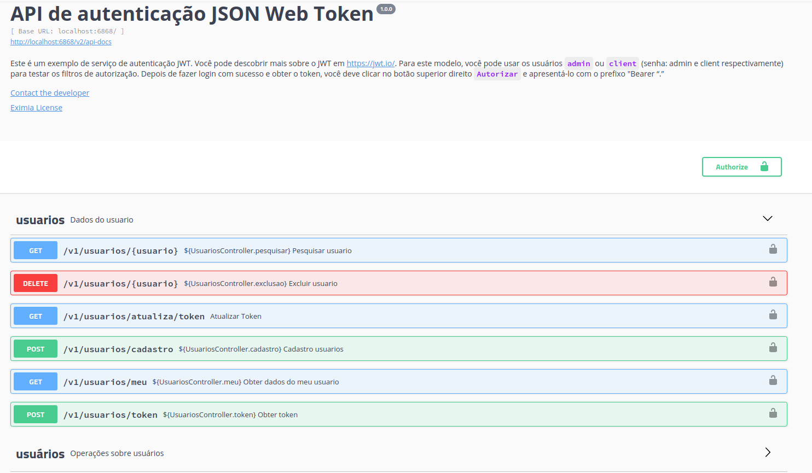

# Spring boot edoc-usuarios-app JWT


# Stack


***

<h3 align="center">Por favor, ajude este repositório com um ⭐ ou <a href='https://github.com/renatodias08/edoc-usuarios-app'>Aplicação</a> </a></h3>

***

# Estrutura de arquivo

```
spring-boot-jwt/
 │
 ├── src/main/java/
 │   └── edoc.usuarios
 │       ├── configuration
 │       │   └── SwaggerConfig.java
 │       │
 │       ├── controller
 │       │   └── UsuariosController.java
 │       │
 │       ├── dto
 │       │   ├── UserDataDTO.java
 │       │   └── UserResponseDTO.java
 │       │
 │       ├── exception
 │       │   ├── CustomException.java
 │       │   └── GlobalExceptionController.java
 │       │
 │       ├── model
 │       │   ├── AppUserRole.java
 │       │   └── AppUser.java
 │       │
 │       ├── repository
 │       │   └── UserRepository.java
 │       │
 │       ├── security
 │       │   ├── JwtTokenFilter.java
 │       │   ├── JwtTokenFilterConfigurer.java
 │       │   ├── JwtTokenProvider.java
 │       │   ├── MyUserDetails.java
 │       │   └── WebSecurityConfig.java
 │       │
 │       ├── service
 │       │   └── UserService.java
 │       │
 │       └── App.java
 │
 ├── src/main/resources/
 │   └── application.yml
 │
 ├── .gitignore
 ├── LICENSE
 ├── mvnw/mvnw.cmd
 ├── README.md
 └── pom.xml
```

# Introdução (https://jwt.io)-(https://jwt.io/#debugger-io)

Só para dar uma ideia, temos uma introdução maravilhosa, cortesia de **jwt.io**! Vamos dar uma olhada:

## O que é JSON Web Token?

JSON Web Token (JWT) é um padrão aberto (RFC 7519) que define uma maneira compacta e independente de transmitir informações com segurança entre as partes como um objeto JSON. Essas informações podem ser verificadas e confiáveis porque são assinadas digitalmente. Os JWTs podem ser assinados usando um segredo (com o algoritmo HMAC) ou um par de chaves pública/privada usando RSA.

Vamos explicar melhor alguns conceitos desta definição.

**Compacto**: devido ao seu tamanho menor, os JWTs podem ser enviados por meio de uma URL, parâmetro POST ou dentro de um cabeçalho HTTP. Além disso, o tamanho menor significa que a transmissão é rápida.

**Autocontido**: A carga útil contém todas as informações necessárias sobre o usuário, evitando a necessidade de consultar o banco de dados mais de uma vez.

## Quando você deve usar JSON Web Tokens?

Aqui estão alguns cenários em que JSON Web Tokens são úteis:

**Autenticação**: Este é o cenário mais comum para usar JWT. Depois que o usuário estiver logado, cada solicitação subsequente incluirá o JWT, permitindo que o usuário acesse rotas, serviços e recursos permitidos com aquele token. Single Sign On é um recurso que usa amplamente o JWT hoje em dia, devido à sua pequena sobrecarga e à capacidade de ser facilmente usado em diferentes domínios.

**Troca de informações**: JSON Web Tokens são uma boa maneira de transmitir informações com segurança entre as partes. Como os JWTs podem ser assinados (por exemplo, usando pares de chaves públicas/privadas), você pode ter certeza de que os remetentes são quem dizem ser. Além disso, como a assinatura é calculada usando o cabeçalho e a carga útil, você também pode verificar se o conteúdo não foi adulterado.

## Qual é a estrutura do JSON Web Token?

JSON Web Tokens consistem em três partes separadas por pontos **(.)**, que são:

1. Cabeçalho
2. Carga útil
3. Assinatura

Portanto, um JWT normalmente se parece com o seguinte.

`xxxxx`.`aaaa`.`zzzzz`

Vamos dividir as diferentes partes.

**Cabeçalho**

O cabeçalho normalmente consiste em duas partes: o tipo de token, que é JWT, e o algoritmo de hash usado, como HMAC SHA256 ou RSA.

Por exemplo:

```json
{
  "alg": "HS256",
  "typ": "JWT"
}
```

Então, este JSON é codificado em Base64Url para formar a primeira parte do JWT.

**Carga útil**

A segunda parte do token é a carga útil, que contém as declarações. As declarações são declarações sobre uma entidade (normalmente, o usuário) e metadados adicionais. Existem três tipos de reivindicações: reivindicações reservadas, públicas e privadas.

- **Declarações reservadas**: trata-se de um conjunto de declarações predefinidas que não são obrigatórias, mas recomendadas, para fornecer um conjunto de declarações úteis e interoperáveis. Alguns deles são: iss (emissor), exp (tempo de expiração), sub (assunto), aud (público) e outros.

> Observe que os nomes das declarações têm apenas três caracteres, pois o JWT deve ser compacto.

- **Declarações públicas**: podem ser definidas à vontade por quem usa JWTs. Mas, para evitar colisões, eles devem ser definidos no IANA JSON Web Token Registry ou como um URI que contém um namespace resistente a colisões.

- **Reivindicações privadas**: são as reivindicações personalizadas criadas para compartilhar informações entre as partes que concordam em usá-las.

Um exemplo de carga útil poderia ser:

```json
{
  "sub": "1234567890",
  "name": "John Doe",
  "admin": true
}
```

A carga útil é então codificada em Base64Url para formar a segunda parte do JSON Web Token.

**Assinatura**

Para criar a parte da assinatura, você deve pegar o cabeçalho codificado, a carga útil codificada, um segredo, o algoritmo especificado no cabeçalho e assiná-lo.

Por exemplo, se você quiser usar o algoritmo HMAC SHA256, a assinatura será criada da seguinte maneira:

```
HMACSHA256(
   base64UrlEncode(cabeçalho) + "." +
   base64UrlEncode(carga útil),
   segredo)
```

A assinatura é usada para verificar se o remetente do JWT é quem diz ser e para garantir que a mensagem não foi alterada ao longo do caminho.
Juntando tudo

A saída são três strings Base64 separadas por pontos que podem ser facilmente passadas em ambientes HTML e HTTP, sendo mais compactas quando comparadas a padrões baseados em XML, como SAML.


Resultados de tradução
Resultado da tradução

## Como funcionam os JSON Web Tokens?

Na autenticação, quando o usuário fizer login com sucesso usando suas credenciais, um JSON Web Token será retornado e deverá ser salvo localmente (normalmente no armazenamento local, mas cookies também podem ser usados), em vez da abordagem tradicional de criação de uma sessão no servidor e retornando um cookie.

Sempre que o usuário desejar acessar uma rota ou recurso protegido, o agente do usuário deverá enviar o JWT, normalmente no cabeçalho Authorization usando o esquema Bearer. O conteúdo do cabeçalho deve ser semelhante ao seguinte:

`Authorization: Bearer <token>`

Este é um mecanismo de autenticação sem estado, pois o estado do usuário nunca é salvo na memória do servidor. As rotas protegidas do servidor verificarão se há um JWT válido no cabeçalho de autorização e, se estiver presente, o usuário terá permissão para acessar recursos protegidos. Como os JWTs são independentes, todas as informações necessárias estão lá, reduzindo a necessidade de consultar o banco de dados diversas vezes.

Isso permite que você confie totalmente em APIs de dados sem estado e até mesmo faça solicitações para serviços downstream. Não importa quais domínios estão servindo suas APIs, então o Cross-Origin Resource Sharing (CORS) não será um problema, pois não usa cookies.


# JWT Authentication Summary

Token based authentication schema's became immensely popular in recent times, as they provide important benefits when compared to sessions/cookies:

- CORS
- No need for CSRF protection
- Better integration with mobile
- Reduced load on authorization server
- No need for distributed session store

Some trade-offs have to be made with this approach:

- More vulnerable to XSS attacks
- Access token can contain outdated authorization claims (e.g when some of the user privileges are revoked)
- Access tokens can grow in size in case of increased number of claims
- File download API can be tricky to implement
- True statelessness and revocation are mutually exclusive

**O fluxo de autenticação JWT é muito simples**

1. O usuário obtém tokens de atualização e acesso fornecendo credenciais ao servidor de autorização
2. O usuário envia token de acesso com cada solicitação para acessar recursos de API protegidos
3. O token de acesso é assinado e contém a identidade do usuário (por exemplo, ID do usuário) e solicitações de autorização.

É importante observar que as reivindicações de autorização serão incluídas no token de acesso. Por que isso é importante? Bem, digamos que as reivindicações de autorização (por exemplo, privilégios de usuário no banco de dados) sejam alteradas durante a vida útil do token de acesso. Essas alterações não entrarão em vigor até que um novo token de acesso seja emitido. Na maioria dos casos, isso não é um grande problema, porque os tokens de acesso têm vida curta. Caso contrário, escolha o padrão de token opaco.

# Detalhes de implementação

Vamos ver como podemos implementar a autenticação baseada em token JWT usando Java e Spring, enquanto tentamos reutilizar o comportamento padrão de segurança do Spring sempre que possível. O framework Spring Security vem com classes de plug-ins que já tratam de mecanismos de autorização como: cookies de sessão, HTTP Basic e HTTP Digest. No entanto, falta suporte nativo para JWT e precisamos colocar a mão na massa para fazê-lo funcionar.

## H2 BD


Resultados de tradução
Resultado da tradução
Esta demonstração está usando atualmente um banco de dados H2 chamado **test_db** para que você possa executá-lo rapidamente e pronto para uso, sem muita configuração. Se você deseja se conectar a um banco de dados diferente, você deve especificar a conexão no campo`application.yml` arquivo dentro do diretório de recursos. Observe que `hibernate.hbm2ddl.auto=create-drop` 
Resultados de tradução
Resultado da tradução
irá descartar e criar um banco de dados limpo cada vez que implantarmos (você pode querer alterá-lo se estiver usando isso em um projeto real). Aqui está o exemplo do projeto, veja como é fácil trocar comentários no `url`
 e `dialect` properties para usar seu próprio banco de dados MySQL:

```yml
spring:
  datasource:
    url: jdbc:h2:mem:test_db;DB_CLOSE_DELAY=-1;DB_CLOSE_ON_EXIT=FALSE
    # url: jdbc:mysql://localhost:3306/user_db
    username: root
    password: root
  tomcat:
    max-wait: 20000
    max-active: 50
    max-idle: 20
    min-idle: 15
  jpa:
    hibernate:
      ddl-auto: create-drop
    properties:
      hibernate:
        dialect: org.hibernate.dialect.H2Dialect
        # dialect: org.hibernate.dialect.MySQL8Dialect
        format_sql: true
        id:
          new_generator_mappings: false
```

## Core Code

1. `JwtTokenFilter`
2. `JwtTokenFilterConfigurer`
3. `JwtTokenProvider`
4. `MyUserDetails`
5. `WebSecurityConfig`

**JwtTokenFilter**

O filtro `JwtTokenFilter` é aplicado a cada API (`/**`), com exceção do endpoint do token de login (`/usuarios/token`) e do endpoint de registro (`/cadastro`).

Este filtro tem as seguintes responsabilidades:

1. Verifique o token de acesso no cabeçalho de autorização. Se o token de acesso for encontrado no cabeçalho, delegue a autenticação para `JwtTokenProvider`, caso contrário, lançará uma exceção de autenticação
2. Invoca estratégias de sucesso ou falha com base no resultado do processo de autenticação realizado por JwtTokenProvider

Certifique-se de que `chain.doFilter(request, response)` seja invocado após a autenticação bem-sucedida. Você deseja que o processamento da solicitação avance para o próximo filtro, porque o último filtro *FilterSecurityInterceptor#doFilter* é responsável por realmente invocar o método em seu controlador que está manipulando o recurso de API solicitado.

```java
String token = jwtTokenProvider.resolveToken((HttpServletRequest) req);
if (token != null && jwtTokenProvider.validateToken(token)) {
  Authentication auth = jwtTokenProvider.getAuthentication(token);
  SecurityContextHolder.getContext().setAuthentication(auth);
}
filterChain.doFilter(req, res);
```

**JwtTokenFilterConfigurer**

Adds the `JwtTokenFilter` to the `DefaultSecurityFilterChain` of spring boot security.

```java
JwtTokenFilter customFilter = new JwtTokenFilter(jwtTokenProvider);
http.addFilterBefore(customFilter, UsernamePasswordAuthenticationFilter.class);
```

**JwtTokenProvider**

O `JwtTokenProvider` tem as seguintes responsabilidades:

1. Verifique a assinatura do token de acesso
2. Extraia declarações de identidade e autorização do token de acesso e use-as para criar UserContext
3. Se o token de acesso estiver malformado, expirado ou simplesmente se o token não estiver assinado com a chave de assinatura apropriada, a exceção de autenticação será lançada

**MyUserDetails**

Implementa `UserDetailsService` para definir nossa própria função personalizada *loadUserbyUsername*. A interface `UserDetailsService` é usada para recuperar dados relacionados ao usuário. Ele possui um método chamado *loadUserByUsername* que encontra uma entidade de usuário com base no nome de usuário e pode ser substituído para personalizar o processo de localização do usuário.

É usado pelo `DaoAuthenticationProvider` para carregar detalhes sobre o usuário durante a autenticação.


**WebSecurityConfig**

A classe `WebSecurityConfig` estende `WebSecurityConfigurerAdapter` para fornecer configuração de segurança personalizada.

Os seguintes beans são configurados e instanciados nesta classe:
1. `JwtTokenFilter`
3. `PasswordEncoder`

Além disso, dentro do método `WebSecurityConfig#configure(HttpSecurity http)` configuraremos padrões para definir endpoints de API protegidos/desprotegidos. Observe que desativamos a proteção CSRF porque não usamos cookies.

```java
// Desativar CSRF (falsificação de solicitação entre sites)
http.csrf().disable();

// No session will be created or used by spring security
http.sessionManagement().sessionCreationPolicy(SessionCreationPolicy.STATELESS);

// Pontos de entrada
http.authorizeRequests()//
  .antMatchers("/users/signin").permitAll()//
  .antMatchers("/users/signup").permitAll()//
  // Proibir todo o resto..
  .anyRequest().authenticated();

// Se um usuário tentar acessar um recurso sem ter permissões suficientes
http.exceptionHandling().accessDeniedPage("/login");

// Aplicar JWT
http.apply(new JwtTokenFilterConfigurer(jwtTokenProvider));

```

# Como usar este código?

1. Certifique-se de ter [Java 8](https://www.java.com/download/) and [Maven](https://maven.apache.org) instalado

2. Clone o Repositorio
  
```
$ git clone https://github.com/<your-user>/edoc-usuarios-app
```

3. Navegue até a pasta

```
$ cd edoc-usuarios-app
```

4. Instalar dependências

```
$ mvn install
```

5. Execute o projeto

```
$ mvn spring-boot:run
```

6. Navegar para `http://localhost:8080/swagger-ui.html` no seu navegador para verificar se tudo está funcionando corretamente. Você pode alterar a porta padrão no `application.yml` arquivo

```yml
server:
  port: 8080
```


```yml
swagger: '2.0'
info:
  description: 'Este é um exemplo de serviço de autenticação JWT. Você pode descobrir mais sobre o JWT em [https://jwt.io/](https://jwt.io/). Para este modelo, você pode usar os usuários `admin` ou `client` (senha: admin e client respectivamente) para testar os filtros de autorização. Depois de fazer login com sucesso e obter o token, você deve clicar no botão superior direito `Autorizar` e apresentá-lo com o prefixo "Bearer "."'
  version: 1.0.0
  title: API de autenticação JSON Web Token
  contact:
    email: renato.dias@eximiati.com
  license:
    name: Eximia License
    url: https://www.eximiati.com.br/
host: localhost:8080
basePath: /
tags:
  - name: usuarios
    description: Usuarios Controller
  - name: usuários
    description: Operações sobre usuários
paths:
  /usuarios/atualiza/token:
    get:
      tags:
        - usuarios
      summary: atualiza
      operationId: atualizaUsingGET
      produces:
        - application/json
      responses:
        '200':
          description: OK
          schema:
            type: string
      security:
        - Authorization:
            - global
      deprecated: false
  /usuarios/cadastro:
    post:
      tags:
        - usuarios
      summary: ${UsuariosController.cadastro}
      operationId: signupUsingPOST
      consumes:
        - application/json
      produces:
        - application/json
      parameters:
        - in: body
          name: user
          description: Cadastro usuarios
          required: false
          schema:
            $ref: '#/definitions/UsuarioDataDTO'
      responses:
        '200':
          description: OK
          schema:
            type: string
        '400':
          description: Algo deu errado
        '403':
          description: Acesso negado
        '422':
          description: O nome de usuário já está em uso
      security:
        - Authorization:
            - global
      deprecated: false
  /usuarios/meu:
    get:
      tags:
        - usuarios
      summary: ${UsuariosController.meu}
      operationId: whoamiUsingGET
      produces:
        - '*/*'
      responses:
        '200':
          description: OK
          schema:
            $ref: '#/definitions/UsuarioResponseDTO'
        '400':
          description: Algo deu errado
        '403':
          description: Acesso negado
        '500':
          description: Token JWT expirado ou inválido
      security:
        - Authorization:
            - global
        - apiKey: []
      deprecated: false
  /usuarios/token:
    post:
      tags:
        - usuarios
      summary: ${UsuariosController.token}
      operationId: loginUsingPOST
      consumes:
        - application/json
      produces:
        - application/json
      parameters:
        - name: senha
          in: query
          description: senha
          required: false
          type: string
          allowEmptyValue: false
        - name: usuario
          in: query
          description: usuario
          required: false
          type: string
          allowEmptyValue: false
      responses:
        '200':
          description: OK
          schema:
            type: string
        '400':
          description: Algo deu errado
        '422':
          description: Nome de usuário/senha inválidos fornecidos
      security:
        - Authorization:
            - global
      deprecated: false
  /usuarios/{usuario}:
    get:
      tags:
        - usuarios
      summary: ${UsuariosController.pesquisar}
      operationId: searchUsingGET
      produces:
        - '*/*'
      parameters:
        - name: usuario
          in: path
          description: Usuario
          required: false
          type: string
      responses:
        '200':
          description: OK
          schema:
            $ref: '#/definitions/UsuarioResponseDTO'
        '400':
          description: Algo deu errado
        '403':
          description: Acesso negado
        '404':
          description: O usuário não existe
        '500':
          description: Token JWT expirado ou inválido
      security:
        - Authorization:
            - global
        - apiKey: []
      deprecated: false
    delete:
      tags:
        - usuarios
      summary: ${UsuariosController.exclusao}
      operationId: deleteUsingDELETE
      produces:
        - application/json
      parameters:
        - name: usuario
          in: path
          description: usuario
          required: false
          type: string
      responses:
        '200':
          description: OK
          schema:
            type: string
        '400':
          description: Algo deu errado
        '403':
          description: Acesso negado
        '404':
          description: O usuário não existe
        '500':
          description: Token JWT expirado ou inválido
      security:
        - Authorization:
            - global
        - apiKey: []
      deprecated: false
securityDefinitions:
  Authorization:
    type: apiKey
    name: Authorization
    in: header
definitions:
  UsuarioDataDTO:
    type: object
    properties:
      username:
        type: string
      email:
        type: string
      password:
        type: string
      appUserRoles:
        type: array
        items:
          type: string
          enum:
            - ROLE_ADMIN
            - ROLE_CLIENT
    title: UsuarioDataDTO
  UsuarioResponseDTO:
    type: object
    properties:
      id:
        type: integer
        format: int32
      username:
        type: string
      email:
        type: string
      appUserRoles:
        type: array
        items:
          type: string
          enum:
            - ROLE_ADMIN
            - ROLE_CLIENT
    title: UsuarioResponseDTO

```

7. Faça uma solicitação GET para `/usuarios/meu` para verificar se você não está autenticado. Você deverá receber uma resposta com um `403` com um `Access Denied` mensagem, pois você ainda não definiu seu token JWT válido
```
$ curl -X GET http://localhost:8080/usuarios/meu
```

8. Faça uma solicitação POST para `/usuarios/token` com o usuário administrador padrão que criamos programaticamente para obter um token JWT válido
```
$ curl -X POST 'http://localhost:8080/usuarios/token?senha=admin&usuario=admin'
```

9. Adicione o token JWT como parâmetro Header e faça a solicitação GET inicial para `/usuarios/meu` novamente

```
$ curl -X GET http://localhost:8080/usuarios/meu -H 'Authorization: Bearer <JWT_TOKEN>'
```

10.E é isso, parabéns! Você deverá receber uma resposta semelhante a esta, o que significa que agora você está autenticado

```javascript
{
  "id": 1,
  "username": "admin",
  "email": "admin@email.com",
  "roles": [
     "ROLE_ADMIN", "ROLE_CLIENT"
  ]
}
```

# Contribuição

- Relatar problemas
- Solicitação pull aberta com melhorias
- Entre em contato comigo diretamente em <renatodias08@gmail.com>